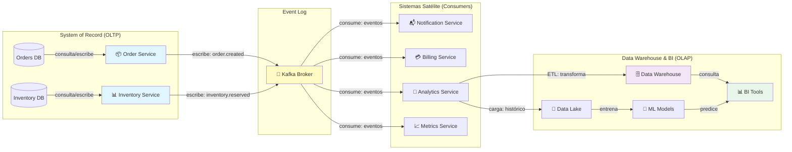
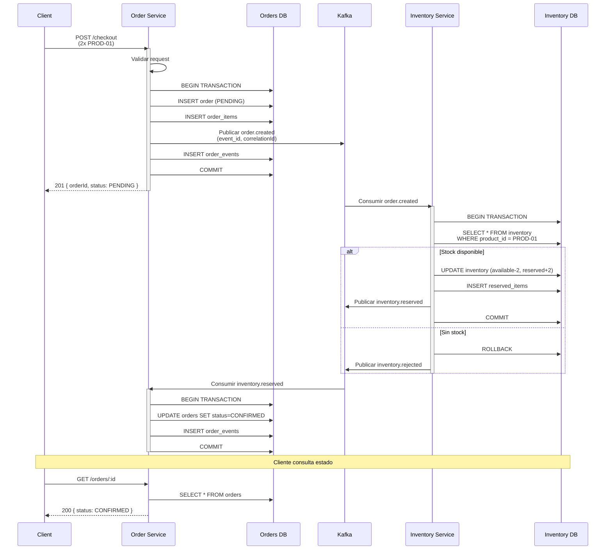

# Arquitectura Event-Driven para E-Commerce
## Brief Académico

---

## A1) ARQUITECTURA APLICADA AL E-COMMERCE

### 1.1 System of Record (SOR)

El **System of Record** es la fuente única de verdad para datos críticos del negocio. En esta arquitectura:

| Componente | Datos Críticos | Responsabilidad |
|-----------|-----------------|-----------------|
| **Order Service** | Órdenes (Order DB) | Registro único de transacciones, estados de pedidos, historial de cambios |
| **Inventory Service** | Inventario (Inventory DB) | Inventario disponible, reservas, stock actualizado en tiempo real |
| **Kafka/Redpanda** | Event Log | Registro inmutable de eventos (event sourcing), trazabilidad distribuida |

**Características:**
- Transacciones ACID garantizadas en PostgreSQL
- Idempotencia: cada evento se procesa exactamente una vez
- Correlation ID: trazabilidad de transacciones distribuidas
- Auditoría completa: tabla `*_events` registra todos los cambios

---

### 1.2 Sistemas Satélite

Los sistemas satélite **no son fuente de verdad**, sino observadores y consumidores especializados:

```
┌─────────────────────────────────────────────────────────────┐
│                    SISTEMAS SATÉLITE                          │
├─────────────────────────────────────────────────────────────┤
│                                                               │
│  📊 Analytics Service        │ 📬 Notification Service        │
│  (Lee eventos → Data Lake)   │ (Email, SMS, Push)             │
│  Latencia: eventual ~5min    │ Latencia: eventual ~1min       │
│                                                               │
│  💳 Billing Service          │ 📈 Metrics Service             │
│  (Cálculo de facturas)       │ (Prometheus, Grafana)          │
│  Latencia: eventual ~1hora   │ Latencia: real-time            │
│                                                               │
│  🎯 Recommendation Engine    │ 📱 Mobile App Backend          │
│  (Machine Learning)          │ (API READ-ONLY)                │
│  Latencia: batch ~nightly    │ Latencia: cached ~1min         │
│                                                               │
└─────────────────────────────────────────────────────────────┘
```

**Características:**
- Consumen eventos del SOR sin retroalimentación
- Pueden fallar sin afectar el SOR
- Latencia eventual (no crítica)
- Tecnología independiente del SOR

---

### 1.3 Flujo hacia BI (Business Intelligence)

```
┌─────────────────────────────────────────────────────────────────────┐
│                    FLUJO DE DATOS A BI                               │
├─────────────────────────────────────────────────────────────────────┤
│                                                                       │
│  1) ORDER SERVICE & INVENTORY SERVICE                                │
│     ↓ Genera eventos cada vez que cambian datos                      │
│     order.created, order.cancelled, inventory.reserved, etc.         │
│                                                                       │
│  2) KAFKA BROKER (Event Log)                                         │
│     ↓ Centraliza y ordena cronológicamente todos los eventos         │
│     Garantiza: No se pierden eventos, orden causal preservado        │
│                                                                       │
│  3) EVENT STREAMING PIPELINE (Kafka Connect)                         │
│     ↓ Consume eventos y los transforma                               │
│     - Agregaciones: totales por día, por cliente, por producto       │
│     - Enriquecimiento: unión con datos maestros                      │
│     - Normalización: estándares de almacenamiento                    │
│                                                                       │
│  4) DATA WAREHOUSE / DATA LAKE                                       │
│     ↓ Almacena datos históricos (OLAP)                               │
│     - Tablas de hechos: órdenes, items, transacciones                │
│     - Tablas de dimensión: clientes, productos, calendarios          │
│     - SCD (Slowly Changing Dimensions): historial de cambios         │
│                                                                       │
│  5) BI TOOLS                                                         │
│     ↓ Consultan warehouse para reportes                              │
│     - Dashboards: ventas diarias, tendencias, segmentación           │
│     - Análisis: cohortes, retención, LTV (Lifetime Value)            │
│     - Predicción: forecasting, anomalías                             │
│                                                                       │
│  6) DATA SCIENCE / ML                                                │
│     ↓ Modelos entrenados con histórico                               │
│     - Recomendadores: productos similares                            │
│     - Detección de fraude: patrones anómalos                         │
│     - Churn prediction: clientes en riesgo                           │
│                                                                       │
└─────────────────────────────────────────────────────────────────────┘
```

---

### 1.4 Diagrama Flujo: Arquitectura Completa (Mermaid Flowchart)



---

### 1.5 Diagrama Secuencia: Transacción Distribuida (Mermaid Sequence - Opcional)



---

## A2) GOBIERNO TI - MÍNIMO VIABLE (Inspirado en COBIT)

### 2.1 Estructura de Roles

| Rol | Responsabilidad | Ejemplo en Proyecto |
|-----|-----------------|-------------------|
| **CTO / Arquitecto** | Decisiones técnicas estratégicas, trade-offs | Selección de Hono, Kafka, PostgreSQL |
| **Tech Lead** | Implementación, estándares de código | Code review, PR aprobados |
| **DevOps Engineer** | Infraestructura, CI/CD, base de datos | Docker, staging, backups |
| **Product Owner** | Requerimientos, priorización | Definición de SLA |
| **Security Officer** | Políticas de seguridad, cumplimiento | Autenticación, encriptación |
| **BI/Analytics Lead** | Estrategia de datos, reportes | Selección de métricas |

---

### 2.2 Seis Decisiones Gobernadas

#### Decisión 1: Selección de Tecnología
- **Gobernada por**: CTO
- **Criterios**: Performance, costo, comunidad, mantenibilidad
- **Decisión**: Event-driven con Kafka ✓
- **Justificación**: Desacoplamiento, escalabilidad, auditabilidad

#### Decisión 2: Estándares de Código
- **Gobernada por**: Tech Lead
- **Criterios**: TypeScript strict mode, ESLint, pruebas unitarias (mínimo 80% cobertura)
- **Decisión**: TypeScript 5.3.3 + strict mode ✓
- **Cumplimiento**: Pre-commit hooks en git

#### Decisión 3: Versionado de Base de Datos
- **Gobernada por**: DevOps Engineer
- **Criterios**: Migraciones versionadas, rollback seguro
- **Decisión**: Migraciones programáticas en TypeScript ✓
- **Controlado**: Solo ejecutadas en pre-producción antes de prod

#### Decisión 4: Seguridad de Datos
- **Gobernada por**: Security Officer
- **Criterios**: Encriptación en tránsito (TLS), en reposo, RBAC
- **Decisión**: TLS en Kafka (producción), contraseñas en .env.local (no en repo) ✓
- **Próximo**: JWT para autenticación API

#### Decisión 5: SLA de Servicio
- **Gobernada por**: Product Owner + CTO
- **Criterios**: Disponibilidad, latencia, RTO/RPO
- **Decisión**: 99% disponibilidad, latencia P95 < 500ms, RTO 1 hora ✓
- **Medido por**: Prometheus + Grafana

#### Decisión 6: Retención de Datos
- **Gobernada por**: Product Owner + Security Officer
- **Criterios**: Cumplimiento legal, costos, GDPR
- **Decisión**: Eventos: 1 año; órdenes: 7 años; logs: 90 días ✓
- **Implementado por**: Políticas de retención en PostgreSQL y Kafka

---

### 2.3 Cinco Políticas Mínimas

#### Política 1: Desarrollo Seguro
```
Descripción: Código nunca se escribe directamente en main/prod

Procedimiento:
1. Feature branch desde develop
2. Pull Request aprobado por Tech Lead
3. CI/CD (tests + linting) verde
4. Merge a develop (1-2 cambios por sprint)
5. Release a staging (1 semana de pruebas)
6. Release a producción (viernes 2pm máximo)

SLA: 48 horas máximo entre PR y merge
Responsable: Tech Lead
```

#### Política 2: Idempotencia Obligatoria
```
Descripción: Todo cambio de estado es idempotente

Requisito:
- Cada evento tiene event_id único
- Si se procesa 2x el mismo evento, resultado es idéntico
- Validado en: processed_events table

Implementación:
- Consumer siempre chequea isEventProcessed()
- Si existe, ignora sin error
- Permite retries seguros

Auditoría: Trimestral en processed_events
```

#### Política 3: Correlación Distribuida
```
Descripción: Cada request tiene X-Correlation-Id

Requerimiento:
- Header X-Correlation-Id en todo request HTTP
- Si falta, generar UUID
- Incluir en logs (estructurados JSON)
- Propagar a eventos Kafka

Beneficio: Rastrear 1 transacción across multiple servicios

Auditoría: Verificar 100% de logs tienen correlationId
```

#### Política 4: Gestión de Dependencias
```
Descripción: Versiones documentadas y auditadas

Requerimientos:
- package.json: versiones exactas (no ^)
- npm audit: 0 vulnerabilidades críticas
- Auditoría trimestral de dependencias obsoletas
- No usar next (latest) salvo testing

Responsable: DevOps Engineer
CadenciaActualización: Máximo 3 meses

Excepciones: Parches seguridad (mismo día)
```

#### Política 5: Respaldo y Recuperación
```
Descripción: RTO 1 hora, RPO 30 minutos

Procedimiento:
1. PostgreSQL: backup diario (full) + horario (incremental)
2. Kafka: replicación x3 brokers (RPO ~minutos)
3. Docker images: pushear a registro privado (DockerHub)
4. Documentación: runbook de DR en wiki

Prueba: Restauración sin datos trimestral

Responsable: DevOps Engineer
Almacenamiento: Geográficamente distribuido
```

---

## A3) RIESGO Y SEGURIDAD - NIST CSF 2.0

### 3.1 Perfil Actual vs Perfil Objetivo

| Función NIST CSF | Categoría | Perfil Actual | Perfil Objetivo | Gap |
|------------------|-----------|---------------|-----------------|-----|
| **GOVERN** | Gobernanza organizacional | Ad-hoc | Documentado | 🔴 |
| **GOVERN** | Estrategia riesgos | No existe | Matriz de riesgos | 🔴 |
| **GOVERN** | Gestión de activos | Manual | Automatizada | 🟡 |
| | | | | |
| **DETECT** | Monitoreo de redes | Básico | Siem centralizado | 🔴 |
| **DETECT** | Análisis de eventos | Manual | Automatizado | 🟡 |
| **DETECT** | Investigación | Post-factum | Automatizada | 🔴 |
| | | | | |
| **PROTECT** | Control de acceso | RBAC básico | RBAC + MFA | 🟡 |
| **PROTECT** | Identificación | Credenciales | JWT + mTLS | 🔴 |
| **PROTECT** | Datos en tránsito | HTTP | TLS 1.3 | 🟡 |
| **PROTECT** | Datos en reposo | Plain | AES-256 | 🔴 |
| **PROTECT** | Secrets | .env.local | Vault | 🔴 |
| | | | | |
| **RESPOND** | Plan de incidentes | No existe | Documentado | 🔴 |
| **RESPOND** | Comunicación crisis | Ad-hoc | Procedimiento | 🔴 |
| **RESPOND** | Investigación post-incidente | No existe | 48-72h | 🔴 |
| | | | | |
| **RECOVER** | Backup & Restore | Manual | Automatizado | 🟡 |
| **RECOVER** | Business continuity | No existe | RTO 1h, RPO 30m | 🟡 |
| **RECOVER** | Pruebas de recuperación | Nunca | Trimestral | 🔴 |

**Legenda**: 🔴 Crítico (implementar antes de prod) | 🟡 Importante (implementar en 6 meses) | 🟢 Nice-to-have

---

### 3.2 Seis Controles Priorizados

#### Control 1: Autenticación Multi-Factor (MFA)
- **Riesgo mitigado**: Acceso no autorizado a APIs
- **Implementación**: 
  - JWT con firma RS256 (private/public keys)
  - Refresh tokens (15 min expiry)
  - Próximo: 2FA en usuario final via TOTP app
- **Métrica**: % usuarios con 2FA activo (Objetivo: 100% en 6 meses)
- **Costo**: 2 días dev + testing

#### Control 2: Encriptación en Tránsito (TLS 1.3)
- **Riesgo mitigado**: Intercepción de datos (man-in-the-middle)
- **Implementación**:
  - APIs: HTTPS obligatorio (Hono + SSL certificates)
  - Kafka: TLS entre brokers y clientes
  - Base datos: tunel SSH o SSL directo
- **Métrica**: 100% traffic over TLS (audit actualmente: 0%)
- **Costo**: 1 día DevOps + certificados (auto-renovación Let's Encrypt)

#### Control 3: Gestión Centralizada de Secretos
- **Riesgo mitigado**: Exposición de credenciales en código
- **Implementación**:
  - Instalar Vault (HashiCorp open-source)
  - Migrar secretos from .env a Vault
  - Rotar credenciales cada 90 días
- **Métrica**: 0 secretos en git (pre-commit hook detecta)
- **Costo**: 3 días setup + 1 día training

#### Control 4: Logging y Monitoreo Centralizado
- **Riesgo mitigado**: Deteccióntarde de anomalías
- **Implementación**:
  - Pino → ELK Stack (Elasticsearch, Logstash, Kibana)
  - Alerts: anómalo pattern detection (ML)
  - Retención: 90 días hot, 1 año archive
- **Métrica**: MTTR (Mean Time To Response) < 5 min (actualmente: N/A)
- **Costo**: 2 días setup + suscripción ELK

#### Control 5: Pruebas de Seguridad Periódicas
- **Riesgo mitigado**: Vulnerabilidades no detectadas
- **Implementación**:
  - SAST (Static): SonarQube + ESLint en CI
  - DAST (Dynamic): OWASP ZAP mensual
  - Pentest: trimestral por terceros
- **Métrica**: % de vulnerabilidades críticas = 0 (Objetivo: mantenido)
- **Costo**: 1 día SAST setup + $5k trimestral pentest

#### Control 6: Recuperación ante Desastres
- **Riesgo mitigado**: Pérdida total de capacidad operativa
- **Implementación**:
  - Backup geográficamente distribuido (2+ regiones)
  - RTO 1 hora (teste mensualmente)
  - Runbook detallado (wiki editable)
- **Métrica**: Prueba de DR exitosa (último: nunca)
- **Costo**: 2 días procedimiento + overhead infraestructura

---

### 3.3 Plan Mínimo de Respuesta a Incidentes

#### Paso 1: Detección & Declaración (0-15 minutos)

```
Trigger:
- Alert de Prometheus (CPU > 90%, Error rate > 5%)
- Manual: reporte usuario
- Automático: anomalía en logs (ELK ML)

Acciones:
1. Security Officer notificado (Slack #incidents)
2. Tech Lead assess severidad:
   - CRÍTICA (P1): > 5 min downtime, datos afectados
   - ALTA (P2): < 5 min downtime, servicio degradado
   - MEDIA (P3): sin downtime, seguridad menor

3. Abrir ticket en Jira con:
   - Descripción
   - Severidad
   - Correlación IDs del evento
   - Assignee (Tech Lead)

SLA: Confirmación en 5 minutos
```

#### Paso 2: Contención & Análisis (15-60 minutos)

```
Objetivos:
- Evitar propagación del problema
- Root cause analysis
- Comunicación a stakeholders

Acciones:
1. Tech Lead (en paralelo):
   - Revisar logs con correlationId
   - Identificar último evento exitoso
   - Chequear conexiones (DB, Kafka, externos)
   - Crear post-mortem doc

2. DevOps Engineer:
   - Rollback a última versión conocida (si cambios recientes)
   - O restart servicios afectados
   - Monitoreo continuo de métricas

3. Security Officer (si incidente seguridad):
   - Revisar access logs
   - Chequear si datos comprometidos
   - Preparar comunicación regulatoria

SLA (P1): Resolución en 60 min
SLA (P2): Resolución en 4 horas
```

#### Paso 3: Recuperación & Post-Mortem (60+ minutos)

```
Verificación:
1. Servicios healthcheck pasan (GET /health → 200)
2. Flujos críticos testeados (POST /checkout → responde)
3. Métricas normales (latencia < 100ms P95)
4. Logs sin errores últimos 10 minutos

Comunicación:
1. Status page actualizado (público)
2. Stakeholders notificados (Slack #general)
3. Customer support informado de impacto

Post-Mortem (dentro 48 horas):
1. Timeline detallada (qué falló, cuándo, por qué)
2. Impacto: # usuarios, duración, datos afectados
3. Root cause: técnico o procedimiento
4. Preventivo: cómo evitar (arquitectura, policy, training)
5. Correctivo: hotfix elegido
6. Action items: asignar dueños, fechas

Documento: wiki shareable, lecciones aprendidas
```

---

## A4) MÉTRICAS

### 4.1 Métricas DORA

#### Métrica DORA 1: Deployment Frequency (Frecuencia de Deploy)

**Definición:**
```
Cuántas veces por semana se despliega código a producción
Fórmula: # deploys / 7 días
```

**Por qué importa:**
- Indicador de capacidad de entrega
- Ciclos cortos = rápida corrección de bugs
- Reduce riesgo cambios grandes
- Cultura DevOps madura

**Cómo medirla:**
- Fuente: Git tags, deployment logs (CircleCI/GitHub Actions)
- Registrar: timestamp de cada deploy a producción
- Análisis: semanal/mensual

**Métrica DORA 2: Lead Time for Changes (Tiempo Líder de Cambios)**

**Definición:**
```
Tiempo desde commit hasta en producción
Fórmula: (deploy date - commit date) en horas
Percentil: P50, P95
```

**Por qué importa:**
- Mide velocidad de entrega de features
- Feedback más rápido del mercado
- Detecta cuellos de botella (testing lento, aprobaciones)
- Competitividad de negocio

**Cómo medirla:**
- Fuente: Jira (creación ticket → deployado en PR)
- Registrar: timestamp automático en cada deploy
- Histórico: trailing average 30 días
- Target: Median < 1 día, P95 < 3 días

**Ejemplo:**
```
Semana 1: 
  - Deploy/día: vNo, 1 solo viernes
  - Lead time promedio: 48 horas (4 cambios)

Semana 2: 
  - Deploy/día: 0.4 (2 deployes)
  - Lead time promedio: 36 horas (5 cambios)

Tendencia: ↑ mejorando (desembarcar frecuente)
```

---

### 4.2 Métricas Operativas

#### Métrica Operativa 1: Latencia de API (P95)

**Definición:**
```
Percentil 95 del tiempo de respuesta en milisegundos
Fórmula: quantile(response_time_ms, 0.95)
```

**Por qué importa:**
- Experiencia usuario directo
- SLA contractual (típicamente < 500ms)
- Detecta degradación performance
- Identifica queries lentas o cuellos

**Cómo medirla:**
- Fuente: Prometheus (histograma http_request_duration_seconds)
- Instrumentación: Pino-http middleware
- Granularidad: por endpoint
- Alertas: > 500ms → escalar dev
- Dashboard: Grafana con histórico 30 días

**Ecuación:**
```
POST /checkout latency:
  P50: 45ms (mediana rápida)
  P95: 120ms (95% de usuarios < 120ms)
  P99: 250ms (outliers lentos)
  
Target: P95 < 200ms
```

#### Métrica Operativa 2: Error Rate (Tasa de Errores)

**Definición:**
```
Porcentaje de requests que retornan 4xx, 5xx
Fórmula: (# 4xx + # 5xx) / total requests * 100%
```

**Por qué importa:**
- Indicador de salud del sistema
- Detecta bugs introducidos
- SLA típicamente < 0.5%
- Causa directa de perdida de ingresos

**Cómo medirla:**
- Fuente: Prometheus (http_requests_total) o logs
- Granularidad: por endpoint, por status code
- Alerta: > 1% durante 5 min → PagerDuty
- Análisis: agrupar por tipo error (timeout, 500, etc)

**Ecuación (ejemplo):**
```
POST /checkout: 
  - Total requests: 100,000
  - Exitosos (200): 99,500 (99.5%)
  - Cliente errors (4xx): 400 (0.4%)
  - Server errors (5xx): 100 (0.1%)
  
Error rate = 0.5% → Target < 0.5%, ALERTA
```

---

### 4.3 Dashboard de Métricas (Inspirado en DORA)

```
┌─────────────────────────────────────────────────────────────┐
│                    DORA METRICS DASHBOARD                    │
├──────────────────────────┬──────────────────────────────────┤
│ METRIC              │ THIS WEEK  │ LAST WEEK  │ TARGET       │
├──────────────────────────┼──────────────────────────────────┤
│ Deployment Freq.    │ 3x/week    │ 2x/week    │ 5x/week ✓    │
│ Lead Time           │ 24h (P50)  │ 36h (P50)  │ < 24h ✓      │
│ Change Fail Rate    │ 5%         │ 8%         │ < 15% ✓      │
│ MTTR                │ 45 min     │ 60 min     │ < 60 min ✓   │
├──────────────────────────┼──────────────────────────────────┤
│ API Latency (P95)   │ 105ms      │ 98ms       │ < 200ms ✓    │
│ Error Rate          │ 0.2%       │ 0.3%       │ < 0.5% ✓     │
│ Uptime              │ 99.9%      │ 99.8%      │ > 99% ✓      │
│ Kafka Lag           │ 500ms      │ 800ms      │ < 5sec ✓     │
└──────────────────────────┴──────────────────────────────────┘

🟢 All metrics green - excellent health
```

---

## Conclusión

Esta arquitectura event-driven implementa:

✅ **System of Record** robusto con PostgreSQL + Kafka  
✅ **Sistemas satélite** desacoplados sin SPOF  
✅ **Flujo a BI** con event streaming pipeline  
✅ **Gobierno TI** mínimo viable pero efectivo  
✅ **Seguridad NIST CSF** con roadmap claro  
✅ **Métricas DORA** para entrega continua  

**Próximos pasos:**
1. Implementar controles 1-3 antes de producción (TLS, MFA, Vault)
2. Configurar dashboards Prometheus + Grafana
3. Establecer runbook de DR y probar
4. Entrenamiento en incident response para equipo
